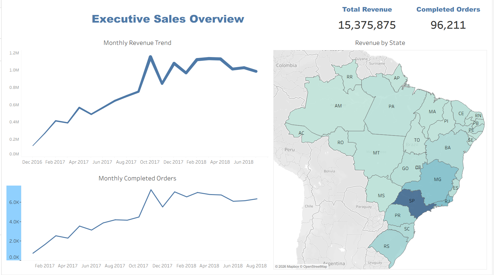
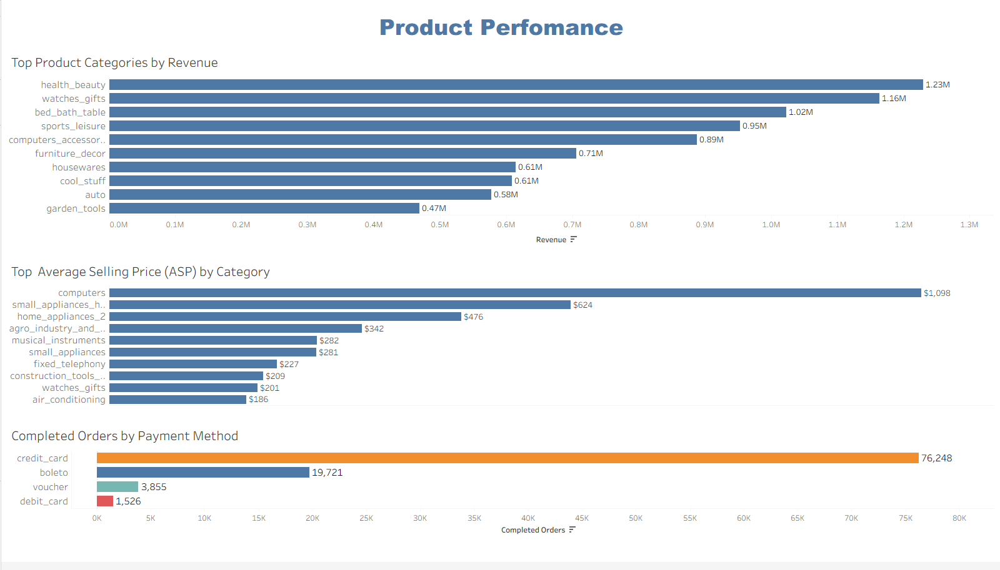

# 📊 Olist E-commerce Sales Analytics

Interactive Tableau dashboard for analyzing sales performance, product categories, payment methods, and regional revenue trends using the Brazilian Olist E-commerce dataset.


---

## 📌 Project Overview

This project analyzes sales data from the Brazilian Olist marketplace to provide business insights into revenue performance, customer purchasing behavior, product categories, payment methods, and regional sales distribution.

The analysis was performed using SQL for data preparation and Tableau for interactive dashboard development.

---

## 🎯 Business Questions

This dashboard answers several key business questions:

- How has revenue changed over time?
- How many completed orders are processed each month?
- Which Brazilian states generate the highest revenue?
- Which product categories generate the most revenue?
- Which categories have the highest Average Selling Price (ASP)?
- Which payment methods are used most frequently?

---

## 🛠 Tools Used

- **SQL** – Data cleaning and business analysis
- **Tableau** – Interactive dashboard development
- **CSV** – Source dataset
- **Git & GitHub** – Version control and project portfolio

---

# 📈 Dashboard 1 — Executive Sales Overview

### Includes:

- Total Revenue KPI
- Completed Orders KPI
- Monthly Revenue Trend
- Monthly Completed Orders
- Revenue by State (Map)

### Preview



---

# 📦 Dashboard 2 — Product Performance

### Includes:

- Top Product Categories by Revenue
- Average Selling Price (ASP) by Category
- Completed Orders by Payment Method

### Preview



---

## 💡 Key Insights

- Revenue increased significantly throughout 2017 before stabilizing in 2018.
- São Paulo (SP) generated the highest revenue among all Brazilian states.
- Health & Beauty was the highest revenue-generating product category.
- Computers had the highest Average Selling Price (ASP).
- Credit Card was by far the most frequently used payment method.

---

## 📂 Repository Structure

```
Olist-Ecommerce-Analysis/
│
├── data/
│
├── images/
│   ├── preview.png
│   ├── executive_sales_overview.png
│   └── product_performance.png
│
├── sql/
│   ├── 01_data_quality.sql
│   └── 02_sales_analysis.sql
│
├── tableau/
│   └── Olist-Ecommerce-Analytics.twbx
│
└── README.md
```

---

## 📊 Tableau Dashboard

View the interactive dashboard here:

🔗 **Tableau Public:**  
(https://public.tableau.com/views/Olist-Ecommerce-Analytics/ProductPerformance?:language=en-US&:sid=&:redirect=auth&:display_count=n&:origin=viz_share_link)

---

## 📁 Dataset

**Brazilian E-Commerce Public Dataset by Olist**

Source:
https://www.kaggle.com/datasets/olistbr/brazilian-ecommerce

---

## 🚀 Skills Demonstrated

- SQL Data Cleaning
- Exploratory Data Analysis (EDA)
- Business Metrics
- Revenue Analysis
- Product Performance Analysis
- Tableau Dashboard Design
- Data Visualization
- Geographic Analysis
- GitHub Portfolio Development

---

## 👤 Author

**Oleksandr Rudenko**

📧 rudenko.alexandr93@gmail.com

🔗 LinkedIn:
www.linkedin.com/in/da-rudenko-alexandr   